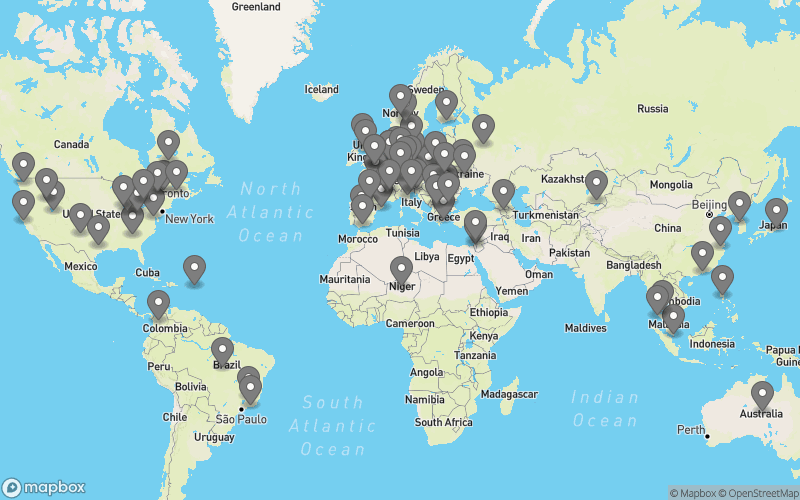

# Home-Assistant on K3s Cluster

[](https://github.com/mysticrenji/home-assistant-on-kubernetes/actions/workflows/main.yaml)
[](https://github.com/mysticrenji/home-assistant-on-kubernetes/actions/workflows/tests.yaml)

## Detailed Setup Guide
For a complete walkthrough of this setup, please refer to my Medium article series:
- [Part 1: Getting Started with Home Assistant on Kubernetes](https://renjithvr11.medium.com/running-your-home-assistant-on-kubernetes-part-i-e66fd24ab8f1)
- [Part 2: Configuration and Integrations](https://renjithvr11.medium.com/running-your-home-assistant-on-kubernetes-part-ii-60eb46a73c61)
- [Part 3: Integration with Generative AI](https://renjithvr11.medium.com/running-your-home-assistant-on-kubernetes-part-iii-9be6f1f2a20e)

## Table of Contents
1. [Overview](#overview)
2. [Architecture](#architecture)
3. [Installation Guide](#installation-guide)
   - [3.1. K3s Installation](#31-k3s-installation)
   - [3.2. Nvidia Setup](#32-nvidia-setup)
   - [3.3. Cloudflare Setup](#33-cloudflare-setup)
   - [3.4. MetalLB Installation](#34-metallb-installation)
   - [3.5. Cert Manager Installation](#35-cert-manager-installation)
4. [Helm Chart Installation](#helm-chart-installation)
5. [Migration from Raw Manifests](#migration-from-raw-manifests)
6. [Multi-Node Setup](#multi-node-setup)
7. [FAQ](#faq)
8. [Project Statistics](#project-statistics)

## 1. Overview
Personal project to run home-assistant on K3s locally on Nvidia Jetson(ARM64). This project demonstrates running Home Assistant in a Kubernetes environment with various integrations.

## 2. Architecture


In this setup, we have:

### Core Infrastructure
- K3s cluster running on a single ARM64 NVidia Jetson Nano device
- Home-assistant pod using official container image
- All services running in the same namespace for simplified management

### Hardware Integration Services
1. **Bluetooth Integration**
   - Bluez service pod for Bluetooth interface
   - Interfaces with Plant soil sensor via BLE (Bluetooth Low Energy)
   - Direct USB connection to Nvidia Jetson

2. **Zigbee Integration**
   - Zigbee coordinator service for zigbee hardware
   - Connected via USB to Nvidia Jetson
   - Handles communication with zigbee-based sensors
   - Easy integration with Home Assistant using built-in add-ons

### External Access Setup
- Cloudflare tunnel service running inside the cluster
- External access enabled through Cloudflare's secure tunnel
- Domain resolution configured through:
  - Google Domain Servers
  - Cloudflare name server integration
  - Custom domain mapping for easy access

## 3. Installation Guide

### 3.1. K3s Installation
```bash
curl -sfL https://get.k3s.io | INSTALL_K3S_EXEC="server --tls-san SERVERIP --disable servicelb --disable traefik --write-kubeconfig-mode 644 --cluster-cidr=10.10.0.0/16" INSTALL_K3S_VERSION="v1.35.0+k3s1" sh -s -
```

### 3.2. Nvidia Setup
Follow [K3s Nvidia Setup](https://docs.k3s.io/advanced#nvidia-container-runtime-support) documentation and run:
```bash
kubectl create -f https://raw.githubusercontent.com/NVIDIA/k8s-device-plugin/v0.10.0/nvidia-device-plugin.yml
```

### 3.3. Cloudflare Setup
Deploy Cloudflare daemon for secure public access:
```bash
kubectl create -f ./cloudflare-daemon/deployment.yaml
```

### 3.4. MetalLB Installation
```bash
# Install MetalLB
kubectl apply -f https://raw.githubusercontent.com/metallb/metallb/v0.9.3/manifests/namespace.yaml
kubectl apply -f https://raw.githubusercontent.com/metallb/metallb/v0.9.3/manifests/metallb.yaml

# Create secret for encrypted speaker communications
kubectl create secret generic -n metallb-system memberlist --from-literal=secretkey="$(openssl rand -base64 128)"
```

MetalLB Configuration:
```yaml
apiVersion: v1
kind: ConfigMap
metadata:
  namespace: metallb-system
  name: config
data:
  config: |
    address-pools:
    - name: address-pool-1
      protocol: layer2
      addresses:
      - 192.168.2.128/25
```

### 3.5. Cert Manager Installation
```bash
helm repo add jetstack https://charts.jetstack.io
helm repo update
helm install cert-manager jetstack/cert-manager --namespace cert-manager --create-namespace --set installCRDs=true
```

## 4. Helm Chart Installation

A Helm chart is available for deploying the core Home Assistant stack (Home Assistant, Z-Wave JS, Mosquitto). The chart is published automatically via GitHub Pages when changes are pushed to `main`.

### From the Helm repository

```bash
helm repo add home-assistant https://mysticrenji.github.io/home-assistant-on-kubernetes
helm repo update
helm install my-ha home-assistant/home-assistant -f my-values.yaml
```

### From local source

```bash
git clone https://github.com/mysticrenji/home-assistant-on-kubernetes.git
cd home-assistant-on-kubernetes
helm install my-ha ./charts/home-assistant -f my-values.yaml
```

### Minimal example (no hardware devices)

```yaml
# my-values.yaml
homeAssistant:
  hostNetwork: false
  privileged: false
  bluez:
    enabled: false
  matter:
    enabled: false
  devices:
    zigbee:
      enabled: false
    dbus:
      enabled: false
zwavejs:
  enabled: false
ingress:
  enabled: false
certIssuer:
  enabled: false
```

### Full example (Zigbee + Z-Wave + Bluetooth + Ingress)

```yaml
# my-values.yaml
homeAssistant:
  pvc:
    size: 20Gi
  devices:
    zigbee:
      enabled: true
      path: /dev/ttyUSB1
    dbus:
      enabled: true
  bluez:
    enabled: true
  matter:
    enabled: true
zwavejs:
  enabled: true
  devices:
    zwave:
      path: /dev/ttyACM0
mosquitto:
  enabled: true
ingress:
  enabled: true
  host: home.example.com
certIssuer:
  enabled: true
  email: you@example.com
```

### Accessing the dashboard

- **With Ingress**: `https://<your-host>` (e.g. `https://home.example.com`)
- **With hostNetwork**: `http://<node-ip>:8123`
- **Port forward**: `kubectl port-forward -n home-assistant svc/home-assistant 8123:80`

### Full configuration reference

For the complete list of all configurable values, example configurations, device path discovery, and troubleshooting, see [charts/home-assistant/README.md](charts/home-assistant/README.md).

## 5. Migration from Raw Manifests

If you are currently using the raw Kubernetes manifests in `home-automation/`, you can migrate to the Helm chart:

1. Back up your existing PVC data
2. Delete the existing resources: `kubectl delete -f home-automation/`
3. Create a `my-values.yaml` with your customizations (device paths, domain, storage sizes)
4. Install via Helm: `helm install my-ha ./charts/home-assistant -f my-values.yaml`

The raw manifests in `home-automation/` are kept as reference but the Helm chart is the recommended deployment method.

## 6. Multi-Node Setup
1. Install Tailscale VPN on all nodes:
```bash
curl -fsSL https://tailscale.com/install.sh | sh
```

2. On worker nodes, run:
```bash
TOKEN="get token from the control server"
curl -sfL https://get.k3s.io | INSTALL_K3S_EXEC="agent" INSTALL_K3S_VERSION="v1.31.4+k3s1" K3S_URL=http://[ipfromtailscale]:6443 K3S_TOKEN=$TOKEN sh -s - --snapshotter=native
```

## 7. FAQ
**Q: How to enable HACS Addon on Home Assistant?**  
A: Install HACS manually by running this command in the Home Assistant Pod:
```bash
wget -O - https://get.hacs.xyz | bash -
```
Then restart the deployment to see HACS in the left-hand side panel.

## 8. Project Statistics
[](https://star-history.com/#mysticrenji/home-assistant-on-kubernetes&Date)

### Stars World Map

